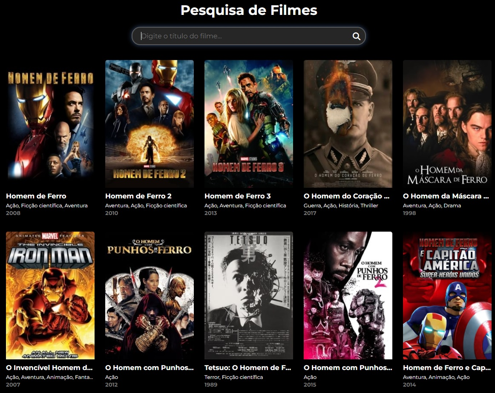

## 🚀 Tecnologias

Esse projeto foi desenvolvido com as seguintes tecnologias:

- HTML
- CSS
- JavaScript

## 💻 Projeto MoviesFlix

Totalmente Responsivo (Versao Desktop e Mobile)
- Consumo de API's do TMDb
- Icones Fontawesome
- Fontes Google

## 🔖 Layout

<h1 align="center">
    
</h1>

## 🔖 Sobre o Projeto

- Apresentamos um projeto de pesquisa de filmes e documentários por meio de uma API. Cada card traz informações detalhadas, como descrição e data de lançamento. Você pode favoritar seus filmes preferidos, criando uma lista personalizada. Lembre-se de que este projeto não permite assistir aos filmes, pois não há links disponíveis. Desfrute da experiência de descobrir e organizar suas escolhas cinematográficas favoritas!

Victor Paranhos 👨🏻‍💻
